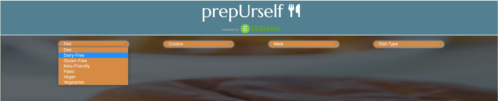
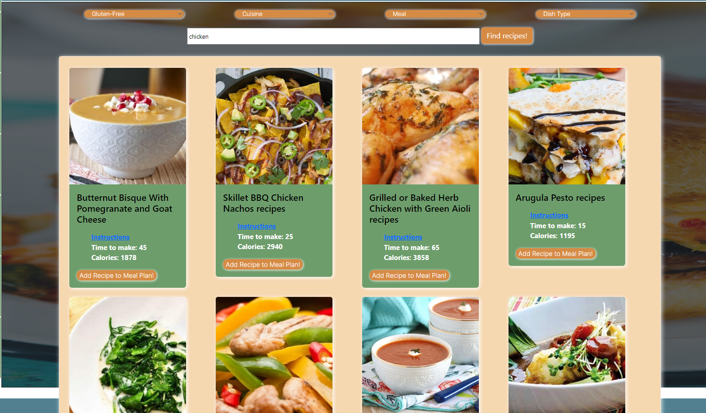

# prepUrself

## Description

prepUrself is a meal planning application that allows users to search recipes, and assign them to days of the week, for an easy way to meal prep!

### User Story

As a meal prepper/planner,

I want to find recipes that meet my diet,

So that I have an easy way to plan my weekly meals.

### Acceptance Criteria

- GIVEN I am a meal prepper/planner
- WHEN I provide dietary requirements
- THEN I am provided with a list of recipes
- WHEN I find a recipe I want to use
- THEN I am able to assign it to a weekly planner
- WHEN I have completed my meal plan
- THEN it will save to the browser

## Usage

# Use the search input to look up a type of dish:

# Filter your options by Diet, Cuisine, Meal, and Dish type:

# Peruse the recipes:

# Choose a where you would like to add the recipe, and see it pop up on your meal planner:

## Credits

Created by For Lack of a Better Team Name👾:

Benjamin Cha - https://github.com/bencha27

Jason Duran - https://github.com/BluSkreen

Erich Ebbinghaus - https://github.com/eebbinghaus

Tessa Robinson - https://github.com/tessie-the-messy

## License

Please refer to the repo for all license info